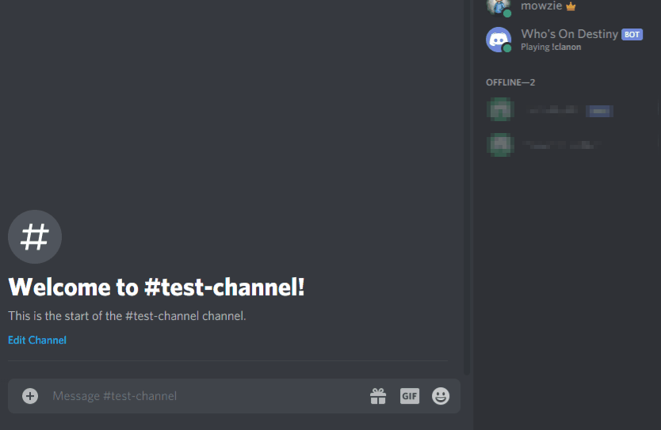

Simple Discord bot that shows who is currently playing and what activity.

If clanmembers are in the same fireteam, then they're grouped together.

Environment variables hide the sensative data as well as where to add the `groupID` for the desired clan.

Activity lists may need some massaging since there are quite a few special cases that don't fit the `type: name` catagory or just need to be trimmed for length.

Currently hosted on an AWS instance.

